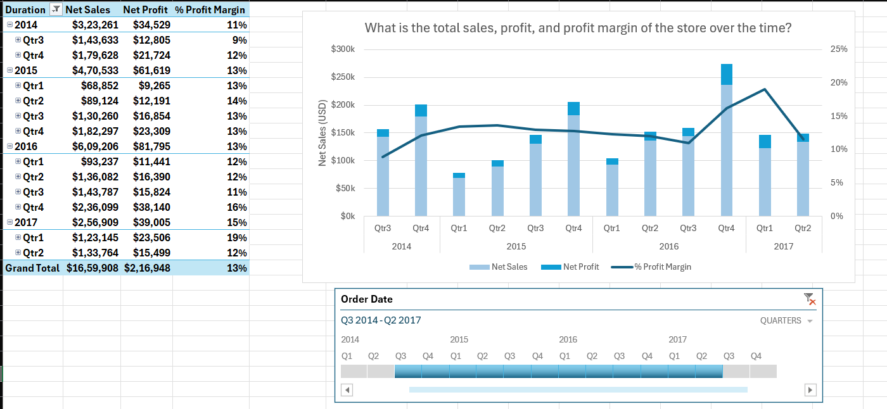
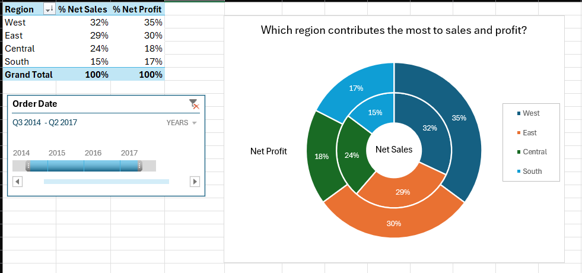
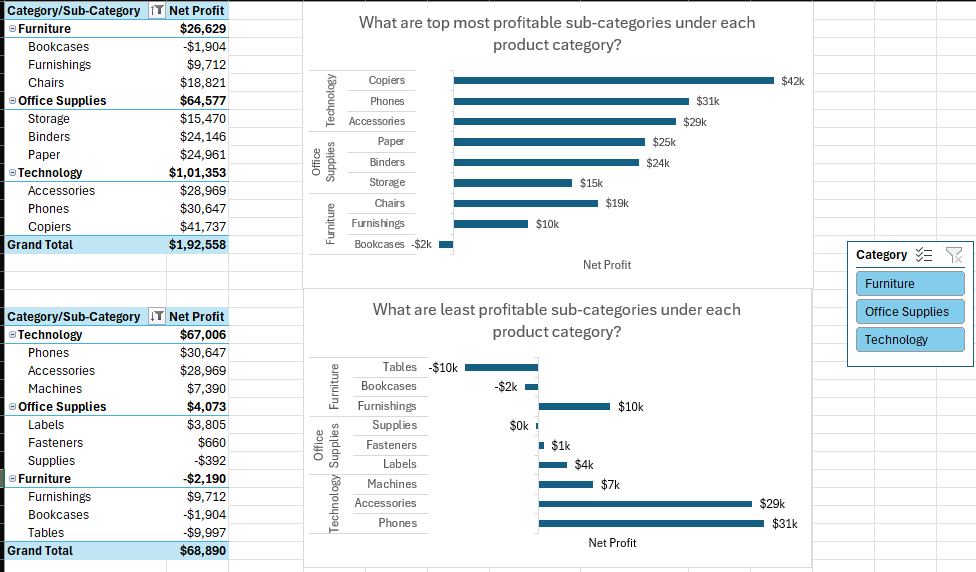
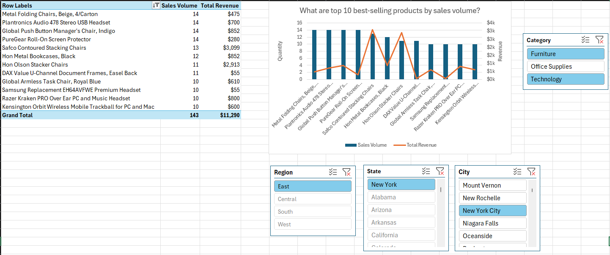
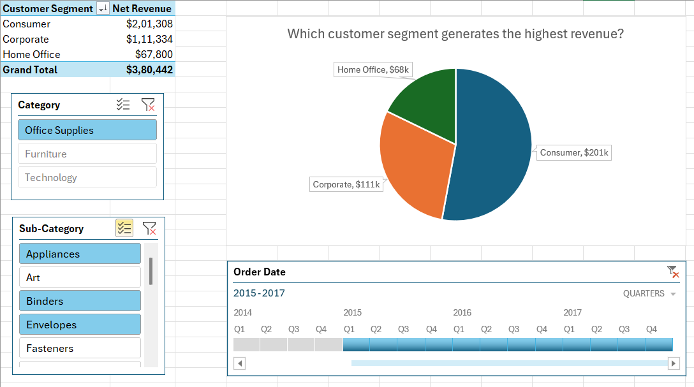
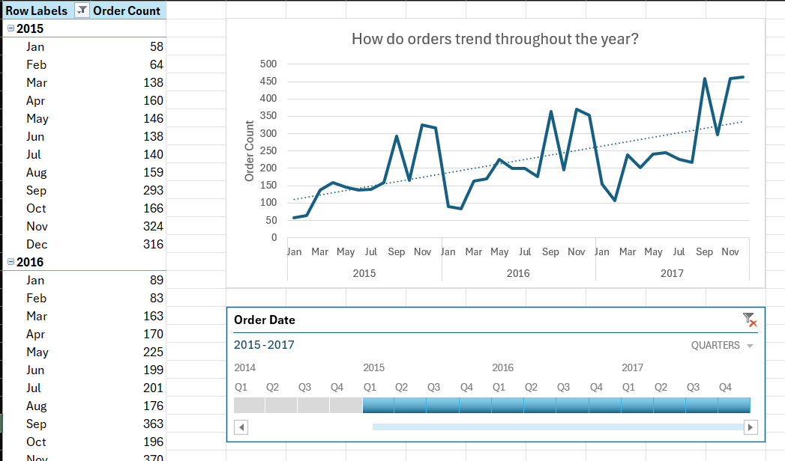
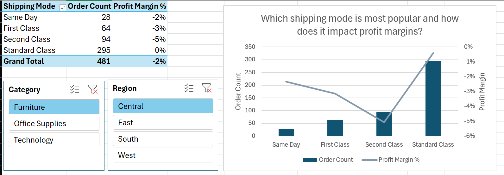

# Sales Data Analysis and ETL Pipeline Development

This project focuses on analyzing sales performance and developing an ETL (Extract, Transform, Load) pipeline to preprocess and analyze sales data effectively. The goal is to derive actionable insights related to overall performance, regional contributions, product trends, customer behaviour and order patterns.

## Overview

### Key Features:

- **ETL Pipeline**: Built using Power Query to clean, preprocess, and transform raw sales data for analysis.

- **Objectives of Sales Analysis**:
  - Total sales, profit, and profit margin trends over time (yearly and monthly).
  - Regional insights, including top-performing regions and those with low profit margins.
  - Product analysis to identify the most and least profitable categories, subcategories,
  - Top 10 best-selling products by sales volume and revenue.
  - Customer segment analysis to determine the highest revenue-generating segment based on timeline, category, and subcategory.
  - Order trends throughout the year based on different timelines.
  - Shipping mode popularity and its impact on profit margins, categorized by region and product category.

- **Visualizations**: Created dashboards and charts to present key metrics and trends.

## Dataset

The dataset used for this project can be found [here](https://community.tableau.com/s/question/0D54T00000CWeX8SAL/sample-superstore-sales-excelxls). It contains the following key columns which have been used in this project:  
- **Sales**: Revenue generated from product sales.  
- **Quantity**: Number of units sold.  
- **Discount**: Percentage discount applied to sales.  
- **Profit**: Net profit earned after accounting for costs and discounts.  
- **Region**, **State**, and **City**: Geographical details of sales.  
- **Category** and **Sub-Category**: Product classifications.  
- **Order Date**: Date when the order was placed.  
- **Ship Mode**: Mode of shipping the order.
- **Profit Margin**: Calculated as Profit/Sales.
- **Cost**: Calculated as Sales - Profit.

## Steps Performed

1. **Data Cleaning and Preprocessing**:
   - Removed duplicates and handled missing values.
   - Ensured consistency in data formats (e.g., dates, numerical columns).
   - Created calculated fields such as profit margin and sales before discount.

2. **ETL Pipeline**:
   - Extracted raw data into Power Query.
   - Transformed data by applying filters, calculated fields, and aggregations.
   - Loaded cleaned data into a suitable format for analysis.

3. **Sales Analysis and Visualizations**:
   - **Overall Performance**: Analyzed total sales, profit, and profit margins over time.

      

   - **Regional Insights**: Determined regional contributions to sales and profit; identified regions with low profit margins.

         

   - **Product Analysis**: Identified profitable and non-profitable categories, subcategories, and top-performing products by sales and revenue.

      

      

   - **Customer Segment Analysis**: Determined the customer segment generating the highest revenue based on timeline, category, and subcategory.

      

   - **Order Trends**: Analyzed order trends throughout the year based on different timelines.

      

   - **Shipping Mode Insights**: Identified the most popular shipping modes and their impact on profit margins, categorized by region and product category.

      

## Tools and Technologies
- **Power Query**: For building the ETL pipeline.
- **Excel Pivot Tables and Charts**: For data analysis and visualization.
- **Data Cleaning Techniques**: To prepare the dataset for accurate analysis.

## Future Enhancements
- Automate the pipeline using Python or Power Automate for real-time updates.
- Integrate advanced visualizations using Power BI or Tableau.
- Perform predictive analysis to forecast sales and profitability trends.

---

**Author**: Dhruv Limbani

