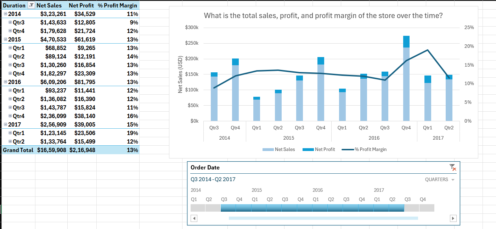
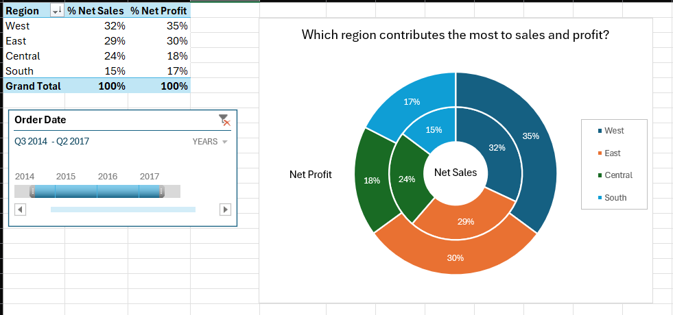
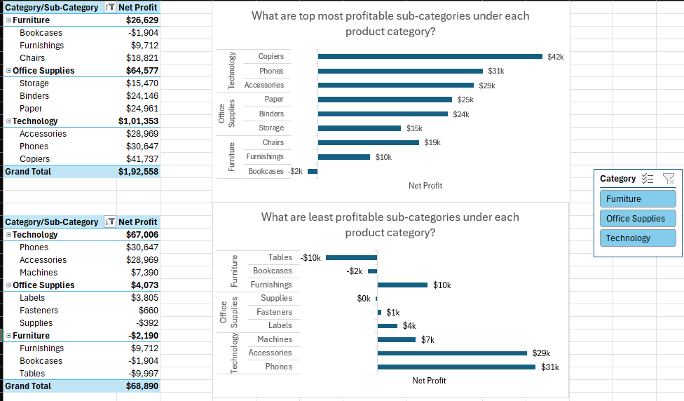
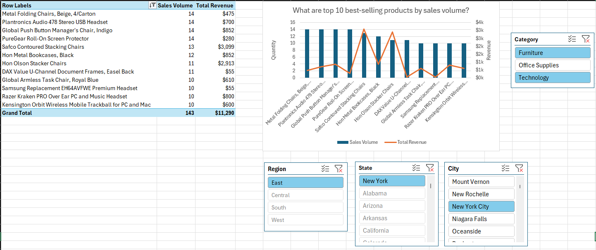

# Sales Data Analysis and ETL Pipeline Development

This project focuses on analyzing sales performance and developing an ETL (Extract, Transform, Load) pipeline to preprocess and analyze sales data effectively. The goal is to derive actionable insights related to overall performance, regional contributions, and product trends.

## Overview

### Key Features:
- **ETL Pipeline**: Built using Power Query to clean, preprocess, and transform raw sales data for analysis.
- **Sales Analysis**:
  - Total sales, profit, and profit margin trends over time (yearly and monthly).
  - Regional insights, including top-performing regions and those with low profit margins.
  - Product analysis to identify the most and least profitable categories, subcategories, and top 10 best-selling products by sales volume and revenue.
- **Visualizations**: Created dashboards and charts to present key metrics and trends.

## Dataset
Following key columns were used from Superstore sales dataset:
- **Sales**: Revenue generated from product sales.
- **Quantity**: Number of units sold.
- **Discount**: Percentage discount applied to sales.
- **Profit**: Net profit earned after accounting for costs and discounts.
- **Region**, **State**, and **City**: Geographical details of sales.
- **Category** and **Sub-Category**: Product classifications.
- **Order Date**: Date when the order was placed.

## Steps Performed

1. **Data Cleaning and Preprocessing**:
   - Removed duplicates and handled missing values.
   - Ensured consistency in data formats (e.g., dates, numerical columns).
   - Created calculated fields such as profit margin and sales before discount.

2. **ETL Pipeline**:
   - Extracted raw data into Power Query.
   - Transformed data by applying filters, calculated fields, and aggregations.
   - Loaded cleaned data into a suitable format for analysis.

3. **Sales Analysis**:
   - **Overall Performance**: Analyzed total sales, profit, and profit margins over time.
   - **Regional Insights**: Determined regional contributions to sales and profit; identified regions with low profit margins.
   - **Product Analysis**: Identified profitable and non-profitable categories, subcategories, and top-performing products by sales and revenue.

4. **Visualization**:
   - Designed dashboards to display trends in sales, profit, and profit margins by year, month, region, and product.
   - Created cascading slicers for interactive filtering by region, state, and city.

## Insights Gained
- Overall Performance of the store
   

- Regions contributing the most to overall sales and profits were identified along with regions having high sales but low-profit-margin.
   

- Categories and subcategories with the highest and lowest profitability were highlighted.
   
  
- Top best selling products were pinpointed for further investigation.
   

## Tools and Technologies
- **Power Query**: For building the ETL pipeline.
- **Excel Pivot Tables and Charts**: For data analysis and visualization.
- **Data Cleaning Techniques**: To prepare the dataset for accurate analysis.

## Future Enhancements
- Automate the pipeline using Python or Power Automate for real-time updates.
- Integrate advanced visualizations using Power BI or Tableau.
- Perform predictive analysis to forecast sales and profitability trends.

---

**Author**: Dhruv  
**Date**: January 2025

